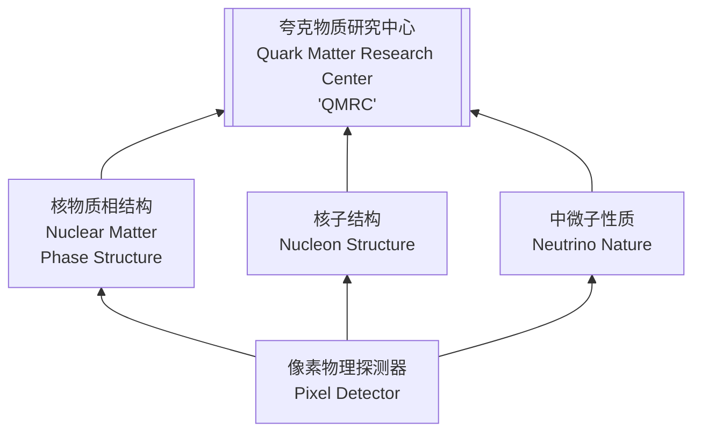

# 近代物理研究所夏令营纪实 Day 2

## Day 2  专题讲座（7/20）

第二天我们就宣布与兰州分院相互独立，兰州分院的学生是在太多，另一方面大家的专业方向都不同，所以我们在第二天与三个分院的同学互相独立，开始各自的夏令营主要活动。

专题讲座是在近代物理所的 6 号楼，也就是最接近重离子加速器的楼。

以前听说重离子加速器，都是在网上看图，无意间也就看到了这张图：

{:width="500"}

没想到真的见到了实物，在近物所 6 号楼的西侧，就挂着这个牌子。寥寥数语，力透纸背。我们很荣幸能在这里合影留念，照片上，我们荣光满面，焕彩重生。

合影之后，我们在四楼大会议室进行讲座，仍旧是上午下午两场，接下来分别介绍：

### Lecture 1  周小红 中低能核物理的研究

{:width="180" .right}

周小红老师的办公地址：<u>工艺楼 5/6楼，1604室</u>

1. 中低能核物理包括核结构、核反应机制与天体环境中的核过程。
2. 近代物理所承接了中国科学院先导 B，新元素合成与超重核稳定岛核素的探寻。
3. 近物所承担了 HIAF、CiADS 的相关探测器设备的建设。
4. 在天体核物理中，IMP 主要研究宇观核以及高密度核物质（中子星）。
5. 中国科学院近代物理研究所致力于扩展核素图。

对于上文中提到部分中低能核物理方面的研究，也有一下几个方面的问题：

#### ① 奇异核、电四极矩

核力的解析表示：

现如今，核力可以被当成四个解析部分处理：即

> 1. 自旋角动量耦合
>
> 2. 动量张量力
> 3. 三体力
> 4. 同位旋相关量

这些内容均是量子力学进行预测于解析的结果，即：

$$ Woods-Saxon $$​ 方程，其中主要讨论了势函数 $$ V(r) $$​

#### ② 核天体物理

研究超重核的形成机制

#### ③ 元素周期表的极限是否存在？超重核稳定岛理论是否存在？

#### ④ 氢原子的 1s 轨道速度于其他重核电子的速度规律、液滴模型

对于氢原子的 1s 轨道，这个电子的速度有：

$$ V_0 = \alpha c \tag{2.1}$$

其中，$$\alpha = \frac{1}{137}$$，精细结构常数；$$c$$ 即为光在真空中的速度。

对于**质子数大于 1 **的核素，经过 Bohr 理论的解释，他们的最内层电子的速度有公式：

$$ V_Z = Z\alpha c = \frac{Z}{137}\cdot c \tag{2.2} $$

但是这样就限制了更重核素的形成，因为根据相对论效应，电子的速度不可能超过光的速度，即 c 的系数一定在 137 以下，所以超重核素的上限应该在 137 以下。

#### ⑤ 什么是液滴模型

**液滴模型，与物质裂变的自发行为有关。**

---

#### 提问环节

##### Q1 如何鉴别原子核新合成的结果？

##### Q2 如何用液滴模型、集体模型、壳模型研究中低能物理？这些理论对于现如今的研究是否仍然适用？

+ 液滴模型

  液滴模型是指原子核的宏观性质，到如今这条理论仍然是正确的。

  与液滴模型在同一时间发展起来的还有核力的四个分支的合成，之前在液滴模型建立时候就有介绍，但是过于简单。如今对这四项力分别做了扩充与修正项，变得逐步完善与解析起来。
  
+ 壳模型

  壳模型假设原子核为球体，但是我们现在知道原子核并不是均匀球体，其具有很多的不同的形状（电四极矩）

  + 通过 QCD 模型考虑的强相互作用

  + 基于 MC 方法进行计算的核模型

  + 基于 pdf 密度泛函的量子色动力学模型等等

  对于壳模型不断完善，但不完全否定。

+ 集体模型

  没有深入研究

##### Q3 重离子的合成方式

+ 逆 $$ \alpha $$ 过程合成（也可以用来寻找）
+ 轻核聚合（对撞轰击）
+ **etc ...**

##### Q4 核天体物理是如何研究的？

结合能 $$ E_B $$，半衰期 $$ T_\frac{1}{2} $$，核反应截面 $$ \sigma_\gamma $$、$$ \sigma_f $$​ 等等这些数值，通过实验室实验或者模拟仿真进行确定

在天体环境中，核反应通常是“网络”形式的，具有较为复杂的形式，因为其能量较高（GeV 量级）

通过模拟仿真得到的结果如果实验有区别的话，进行研究、修正、拟合等操作

##### Q5 $$ \alpha $$ 线的“长射程”与“短射程”的测定？方法？

现在可以对单个粒子进行极高精度的测量，包括 position（即 $$ x,y,z,t $$ ）、$$ E $$、$$ \Omega $$ 等等参量

**<u>打个比方：进行三个月的连续测量，只要待测样品发生一次 $$ \alpha $$ ​​​衰变，IMPCAS 的探测器就可以进行捕捉与记录其精确行为。</u>**

但是真正重要的测量内容，是反应产额 yield 的计算。

##### Q6 回旋加速器

加速一个粒子，不管这个粒子是符合理想条件还是不符合理想条件，总之是在束流中，要加速这个含有不同成分的线束，如果单纯用最普通的回旋加速器的话，大概率是不能成功的，因为就算能避开其他线束的干扰，也会因为能量、功率与输入电损耗之间的巨大的差值而使效果奇差。

为了更好的使用加速器，需要给加速腔加以共振条件，首先分离其他的不符合共振条件的粒子，同时谐振腔也可以使加速粒子的功耗降低，以更低的输入电能得到更好的加速效果。

回旋加速器的能量极限有限，束流强度亦有限，故虽然能够进行有限的加速，但是始终不能作为研究粒子物理的装置一直使用下去，所以才对加速器一代代不断革新。从 1.5 m 回旋加速器到现在的分离扇加速器 SSC 与扇聚焦加速器 SFC，都是在加速器上近物所做出的贡献。

---

### Lecture 2  许怒 高能核物理前沿问题

{: width="180" .right}

#### 1. 引言：为什么要做核物理与高能物理研究？

四大相互作用：强相互作用，弱相互作用，电磁相互作用 + 万有引力。

不考虑万有引力的话，事实上这些研究一直都是在随着时间的不断演进不断发展的。时间不断发展，人类加速器所能够达到的能量就越高，一步步加强，慢慢的发展。

#### 2. 强相互作用相结构（QCD phase structure）

如同水也有三相图，强相互作用也有三相图，即QCD（Quantum Chromodynamics）相图。

水的三种相之间的变换是由于电磁相互作用发生了改变，实际上是一种QED（Quantum Electrodynamics）。

#### 3. 强子结构

通过EIC（Electron Ion Collider）来发现。HIAF 计划内包括此项任务。

#### 4. 中微子结构

> 中微子到底有没有质量？

这是一个自从中微子被发现之后，一直困扰着科学家的一个问题。尽管中微子重量测不出，但是它既然有速度，为什么不能有质量呢？

a) 在标准模型中，基本粒子的质量来源于 Higgs 的相互作用。左旋中微子不与 Higgs 相互作用，因此中微子无质量。

b) 震荡实验证明左旋中微子（Dirac 粒子）可以与 Higgs 相互作用从而产生质量。

c) 修正的标准模型预言右旋中微子（Majorana 粒子）与 Higgs 相互作用产生质量。Majorana 粒子是她自己的反粒子。

为了探究这些现象，有下面三种实验：

1) $$ \beta $$  decay

   $$ n \to p + e + \nu_e $$

2) double $$ \beta $$ decay ( $$ 2\nu\beta\beta $$ experiment )

   $$ (Z,N) \to (Z+2,N-2) + e + e + \nu_e + \nu_e $$

3) double $$ \beta $$ no neutrino decay ( $$ 0\nu\beta\beta $$ experiment )

   $$ (Z,N) \to (Z+2,N-2) + e + e $$

   (In order to make it 0 neutrino, the 2 product neutrino should have annihilation)

其中，只有 $$ 0\nu\beta\beta $$ 可以证明中微子具有质量。为此，近物所牵头成立 $$N\nu DEx$$ 实验组，开展大规模的理论探测实验。同期进行的还有 $$ CEE $$, $$EicC$$, $$IQCD$$ 实验等，这些实验共同都在“夸克中心”进行研究。

理论计算 $$ 0\nu\beta\beta $$ 的发生概率，只有 $$1\#/10^{28}\ a$$，所以想要发现这个，是一件极其困难的事情。

#### 5. 夸克物质研究中心结构

### Lecture 3 冒立军 重离子加速器

{:width="180" .right}

#### 1. 重离子加速器

主要是来加速 A≥4 的带电离子的

#### 2. “加速器 = 望远镜 + 显微镜”

> A. 如何看清尺度很小的东西？

使用的光必须是波长和被观测物体的尺寸差不多的才行，即德布罗意波长

$$ \lambda = \frac{h}{p} = \frac{h}{\gamma mv} = \frac{h}{mv}\sqrt{1-\frac{v^2}{c^2}} $$

电子是一种波，而高速的电子的波长比可见光的波长要短，故可以用电子来观察更加细微的世界

> B. 如何看清尺度很大的东西？

|  观察对象  |          尺寸（cm）          |  束流能量   |      方法      |
| :--------: | :--------------------------: | :---------: | :------------: |
|    细胞    | $$ 10^{-3} $$ ~ $$10^{-5} $$ | 0.1 ~ 10 eV |   光学显微镜   |
|    分子    |       ~ $$ 10^{-7} $$        |   ~1 keV    |   电子显微镜   |
|    原子    |       ~ $$ 10^{-8} $$        |   ~10 keV   |  同步辐射光源  |
|   原子核   |       ~ $$ 10^{-12} $$       |  > 100 MeV  |  中低能加速器  |
|    质子    |       ~ $$ 10^{-13} $$       |   > 1 GeV   | 高能强子加速器 |
| 夸克和轻子 |       ~ $$ 10^{-16} $$       | > 1000 GeV  | 高能粒子对撞机 |
|    ...     |             ...              |     ...     |      ...       |

综上所述：加速器既是望远镜，又是显微镜。

#### 3. 加速器的发展历史：

+ **Cookes Tube**

  最早的加速器

+ **高压倍加器**

  可以加速电子到 700 kV，最高可至 4 MV

+ **范德格拉夫起电器**

  可以加速电子到 10 MV

+ **回旋加速器**

  + **劳伦斯回旋加速器** 

    只有手掌大小，但可以加速电子到 80 keV

  + **回旋加速器**

    一般能够加速到 1.2 MeV， 现在可以达到 100 MeV

  + **RIKEN，日本**

    能够加速电子到 400 MeV，几乎达到工程极限

+ **共振回旋加速器**

  由于自动稳相技术在 1945 年被 Mcmillian 和 Veksler 共同发现，加速器从此开始步入准共振阶段。各种准共振加速器在近似共振的回旋加速器基础上迅速推进。

  **现阶段的回旋加速器基本都要满足共振条件**，在满足共振条件的谐振腔中进行的加速能够大幅度降低所需的电能，大幅度增加加速效率，更容易达到更高的能量。

+ **同步加速器**

  第一台质子同步加速器，BNL，1954，能够达到 3 GeV

+ **聚焦回旋加速器**

  + **弱聚焦回旋加速器**

    上文中提到的同步加速器，其内部具有巨大的铁锷与电磁铁，重量特别庞大（36 kT），但是效果却甚微，称为弱聚焦回旋加速器

  + **强聚焦回旋加速器**

    1950年，Chistofilos 发现了强聚焦原理。而后聚焦回旋加速器也逐步发展。

之后，中国逐步从前苏联学习加速器技术，苏联协助建造 1.5 m 回旋加速器，而后逐步改造，形成近代物理研究所，部分装置能量如下表：

| 年份 |         加速器          | 束流能量  |
| :--: | :---------------------: | :-------: |
| 1960 | 扇聚焦回旋加速器（SFC） | 10 MeV/u  |
| 1980 | 分离扇回旋加速器（SSC） | 100 MeV/u |
| 2000 |    冷却储存环（CSR）    |  1 GeV/u  |

#### 4. 横向对比

单论加速质子的能力，日本的 JPARK 实力比近物所要强

#### 5. 国际任务

近物所承担了国际原子核精确质量的发布，每两年一次，质量可以精确到 $$10^{-7}$$<u>（单位待考证）</u>

#### 6. 加速能力

近物所加速重离子的能力为亚洲第一，能够将 $$ ^{209}U^{32+} $$ 加速到 23.8 GeV。

正因此，近物所承担了重离子的相关研究诸如重离子辐照育种，重离子治癌等

近物所正在拟建的更大的加速器装置HIAF，其主要目的也为重离子加速。

---

